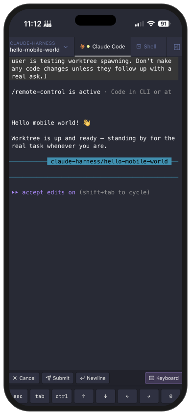

<p align="center">
  
</p>

<h1 align="center">Run a team of agents.</h1>

<p align="center">
  Run ten Claudes at once without losing your mind.<br />
  Ship more, faster, with every session at your fingertips.
</p>

<p align="center">
  <a href="https://github.com/frenchie4111/harness/stargazers">
    
  </a>
</p>

<p align="center">
  <a href="https://harness.mikelyons.org/">Website</a> ·
  <a href="https://github.com/frenchie4111/harness/releases/latest">Download</a> ·
  <a href="https://harness.mikelyons.org/guide.html">Guide</a>
</p>


<table>
  <tr>
    <td width="50%" valign="top">
      <h3>Mobile mode</h3>
      
      <p>Control your agents from your phone. Guaranteed to be better than Claude's shitty remote UI.</p>
    </td>
    <td width="50%" valign="top">
      <h3>Browser control</h3>
      
      <p>Give agents control of your browser. Useful for testing your code locally, or just ordering groceries.</p>
    </td>
  </tr>
</table>

> **→ Visit [harness.mikelyons.org](https://harness.mikelyons.org) for screenshots, feature walkthroughs, and release notes.**

## Download

Grab the latest release from the [releases page](https://github.com/frenchie4111/harness/releases/latest).

- **Apple Silicon (M1/M2/M3/M4):** [Harness-2.10.0-arm64.dmg](https://github.com/frenchie4111/harness/releases/download/v2.10.0/Harness-2.10.0-arm64.dmg)
- **Intel Mac:** [Harness-2.10.0.dmg](https://github.com/frenchie4111/harness/releases/download/v2.10.0/Harness-2.10.0.dmg)

## Installation

### macOS

1. Download the `.dmg` for your Mac architecture from the links above.
2. Open the `.dmg` and drag **Tatsu** into your Applications folder.
3. Launch Tatsu from Applications. The app is signed and notarized, so it should open without any Gatekeeper warnings.
4. On first launch:
   - Pick a git repository when prompted.
   - Click the ⚙ gear icon in the sidebar and paste a [GitHub personal access token](https://github.com/settings/tokens?type=beta) (fine-grained or classic, with `repo` scope). This is optional but required for the PR status panel and checks.
   - When the hooks consent banner appears, click **Enable** so Tatsu can install status-tracking hooks globally at `~/.claude/settings.json`. One install covers every worktree and is what makes the sidebar status dots reliable. Curious what the hook actually runs? See [`src/main/hooks/hooks.ts`](src/main/hooks/hooks.ts) (the bash command built by `makeHookCommand` — it appends one line of JSON per event to `/tmp/harness-status/<id>.ndjson`) and [`src/main/agents/claude.ts`](src/main/agents/claude.ts) (where the install/uninstall logic lives).

### Linux

Grab `Tatsu-<version>.deb` or `Tatsu-<version>.AppImage` from the [releases page](https://github.com/frenchie4111/harness/releases/latest).

**Ubuntu / Debian (.deb)** — the recommended option:

```sh
sudo apt install ./Tatsu-<version>.deb
```

The postinstall script handles the `chrome-sandbox` SUID bit automatically, so this works on Ubuntu 24.04+ out of the box.

`.deb` users get an in-app banner when a new version is available, but updates are manual — re-download the new `.deb` from [GitHub Releases](https://github.com/frenchie4111/harness/releases/latest) and `sudo apt install ./Tatsu-<version>.deb`. (AppImage / macOS users get auto-updates.)

**AppImage** — for distros without `dpkg`:

```sh
chmod +x Tatsu-<version>.AppImage
./Tatsu-<version>.AppImage
```

If you hit `The SUID sandbox helper binary was found, but is not configured correctly` on Ubuntu 24.04+, either install the `.deb` instead or relax the AppArmor unprivileged-userns restriction:

```sh
echo "kernel.apparmor_restrict_unprivileged_userns=0" | sudo tee /etc/sysctl.d/60-apparmor-namespace.conf
sudo sysctl --system
```

### Requirements

- macOS (Apple Silicon or Intel) or x64 Linux (Ubuntu/Debian for the `.deb`; any glibc distro for the AppImage)
- [`claude`](https://code.claude.com) CLI installed and on your login shell's `PATH`
- `git` installed (preinstalled on macOS via Xcode Command Line Tools)

### Network access

Tatsu makes outbound network calls to two places: `api.github.com` (for PR status, check runs, and review state on worktrees that have an open PR) and this project's own GitHub releases feed (for auto-updates via `electron-updater`). If you have the [`gh`](https://cli.github.com) CLI installed and authenticated, Tatsu will optionally pick up your token from it instead of requiring you to paste a PAT.

The optional remote-control WebSocket transport (used by the web client) is off by default, bearer-token-authed, and bound to `127.0.0.1` when enabled; opting in to LAN access (binding to `0.0.0.0`) is a separate explicit config flag.

## Headless server

Run Tatsu on a remote dev box and connect from a local browser, mobile phone, or the Electron app. The headless server is a single tarball (no host Node, no other deps) that ships an embedded Node, the bundled `claude` binary, the web client, and the MCP bridge.

Install with one command:

```sh
curl -fsSL https://raw.githubusercontent.com/frenchie4111/harness/main/scripts/install-headless.sh | sh
```

This downloads the right tarball for your platform (`darwin-arm64`, `linux-x64`, or `linux-arm64`), verifies its sha256, and extracts to `~/.harness-server/`. Intel Macs are not currently shipped — GitHub's macos-13 runner queue is too unreliable to keep in CI. If `/usr/local/bin/` is writable a `harness-server` symlink is dropped there; otherwise you add `~/.harness-server/bin` to your `PATH`.

Run it:

```sh
harness-server --port 0
```

`--port 0` picks an ephemeral port. The server prints both a `ws://` URL (for renderers) and an `http://` URL (the web client) with the auth token embedded as a query string. Pin the `http://` URL on a phone homescreen or browser bookmark — the token survives restarts. To run as a daemon, wrap with `nohup`, `tmux`, or `screen`.

The tarballs are not Apple-signed. On macOS you may need to `xattr -d com.apple.quarantine ~/.harness-server/bin/harness-server` if Gatekeeper objects.

To pin a specific version:

```sh
HARNESS_SERVER_VERSION=2.6.1 sh -c 'curl -fsSL https://raw.githubusercontent.com/frenchie4111/harness/main/scripts/install-headless.sh | sh'
```

Re-running the install script bumps the version. There's no in-place self-update yet.

### Connecting the Electron app to a remote server

Once `harness-server` is running on a remote machine, you can drive it from your local Electron Tatsu alongside the local backend. Open the Tatsu sidebar's backend chip strip (or `File → Add Backend…`), paste the connection link the host's Settings shows (`http://host:port/?token=...`), and click "Test & save". The link's the same one the browser web client uses; Tatsu parses out the token, validates the connection, and persists the backend.

Once added, the chip appears at the bottom of the sidebar. Click to switch — `Cmd+Shift+1..9` jumps directly to the Nth backend (Local is always 1). Each backend has its own worktrees, terminals, browser tabs, and settings; switching changes which backend's UI is rendered, and inactive backends keep streaming so notifications still work. The connections list is encrypted (tokens in `secrets.enc`) and persists across restarts.

## Uninstallation

1. **Remove the Claude Code hooks** (do this while Tatsu is still running). Open Settings → **Agent** → **Status hooks** and click **Remove hooks**. This strips Tatsu's entries from `~/.claude/settings.json` and leaves any user-authored hooks intact.

2. **Quit Tatsu** with ⌘Q.

3. **Delete the app:**

   ```sh
   rm -rf /Applications/Tatsu.app
   ```

   (or drag it to the Trash.)

4. **Remove app data** (optional, for a fully clean uninstall):

   ```sh
   rm -rf ~/Library/Application\ Support/harness
   rm -rf ~/Library/Preferences/org.mikelyons.harness.plist
   rm -rf ~/Library/Saved\ Application\ State/org.mikelyons.harness.savedState
   rm -rf ~/Library/Caches/org.mikelyons.harness
   rm -rf ~/Library/Logs/harness
   ```

5. **If you skipped step 1** and already deleted the app, you can remove the hooks by hand. Open `~/.claude/settings.json` and delete any hook entries whose object contains `"_marker": "__claude_harness__"` — every Tatsu-managed hook is tagged with that marker, so they're safe to identify and remove.

6. **Optional — clean up worktrees.** Tatsu may have created git worktrees under `<repo-name>-worktrees/` next to your repos. These are normal git worktrees and aren't removed automatically. To clean them up:

   ```sh
   cd <your-repo>
   git worktree list
   git worktree remove <path>
   ```

   Or delete the `<repo-name>-worktrees/` directories from disk and run `git worktree prune` in each repo.

## Features

- **Multi-agent** — run Claude Code or Codex in the same window, one harness for both
- **Multi-repo** — manage multiple repos in a single window, switch between them or see everything at once
- **Live PR status** — see open PRs and CI checks for every worktree, auto-sorted by urgency
- **Embedded editor** — full Monaco-powered editor for tweaking files without leaving Tatsu
- **Full code review tool** — side-by-side syntax-highlighted diffs for every changed file in a worktree
- **Status at a glance** — sidebar dots show which agent is working, waiting, or needs approval (powered by Claude Code hooks)
- **Command center** — bird's-eye grid of every worktree with mini activity timelines
- **Tabs + vertical split panes** — Claude, shells, and editor/diff tabs scoped to each checkout, splittable side-by-side
- **9 themes** — dark, dracula, nord, gruvbox, tokyo night, catppuccin, one dark, solarized dark/light
- **Configurable hotkeys** — ⌘1–⌘9 to jump between worktrees, all rebindable
- **MCP: Claude controls Tatsu** — a built-in MCP server lets Claude create and list worktrees on its own

## Why did I build this

Honestly I have been using [Conductor](https://www.conductor.build) for a while as a fairly happy customer, but some rough edges have really started to annoy me so on a random Thursday morning I decided to build my own version of it that works the way I want to. Oh yeah did I mention:

> Originally vibe coded start to finish — these days I occasionally crack open the actual source. Future travelers: still mostly vibes.

# How's it work?

This app is specifically designed to be an easy way to do the sort of ADD fueled multi-worktree development that I have been in-to these days. Along the left you can see all the worktrees you have, and each worktree has it's own claude, additional terminals and PR display.

The main benefit of this is that your worktrees stay organized, and it's very obvious when one of your many claudes needs your attention (the dot will change colors)

## Worktrees

This app assumes that you are going to want to use worktrees (otherwise what's the point)

It will create a worktree directory at `../<your repo folder>-worktrees` and start making worktrees there. This directory will probably be changeable at some point

# Roadmap

The high-level roadmap has been moved here: https://github.com/frenchie4111/harness/issues/31

# Setup, building, and running locally

Clone the repo and install dependencies:

```sh
git clone https://github.com/frenchie4111/harness.git
cd harness
pnpm install
```

Common commands:

| Command | What it does |
|---|---|
| `pnpm dev` | Launch the app in dev mode with hot reload |
| `pnpm build` | Type-check and build main, preload, and renderer to `out/` |
| `pnpm pack` | Build an unsigned `.app` for local smoke testing (fast — skips codesigning and notarization) |
| `pnpm dist:mac` | Full signed + notarized macOS build (requires `.env` with Apple creds) |
| `pnpm rebuild:dev` | Rebuild `node-pty` against the dev Electron version — run this if dev mode errors with `posix_spawnp failed` |
| `pnpm log` | Tail the debug log at `~/Library/Application Support/harness/debug.log` |

After `pnpm pack`, you can launch the unsigned build with:

```sh
open release/mac-arm64/Tatsu.app
```

If Gatekeeper blocks the unsigned app, strip the quarantine attribute first:

```sh
xattr -cr release/mac-arm64/Tatsu.app
```

# Contributing

We absolutely love contributors. See [AGENTS.md](AGENTS.md) for setup, PR conventions, and architecture notes.
